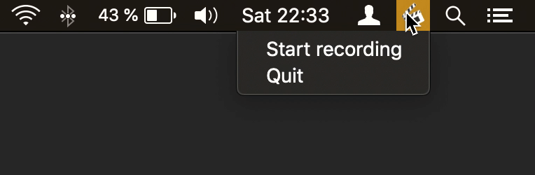

...a little macOS app that records your screen to make a timelapse.


## Features

- Simple
- Open Source
- Easy to access
- Low memory and CPU usage
- Follows the cursor across screens while recording

## Getting started

1. Make sure that you have `ffmpeg` installed (e.g. run `brew install ffmpeg`).
2. Unzip and start the app. If you get a warning about the app being unsigned,
   go to `System Preferences > Security & Privacy` and allow the app to run.
3. A new icon appears in your menubar; start and stop the screen recording from
   there.
   

timelapse will create a video for you **in your `Movies` folder**.

## Development

If you like to help improve this app, make sure you have at least Python 3.6
installed. First, install the project's dependencies:

```shell
make install
```

Now make changes and run the main application from the commandline:

```shell
make run
```